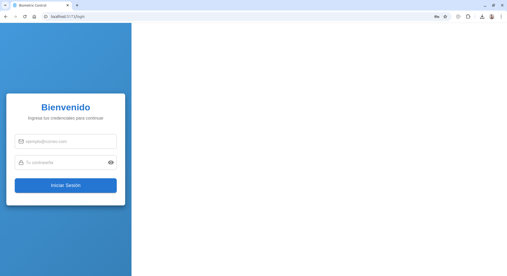
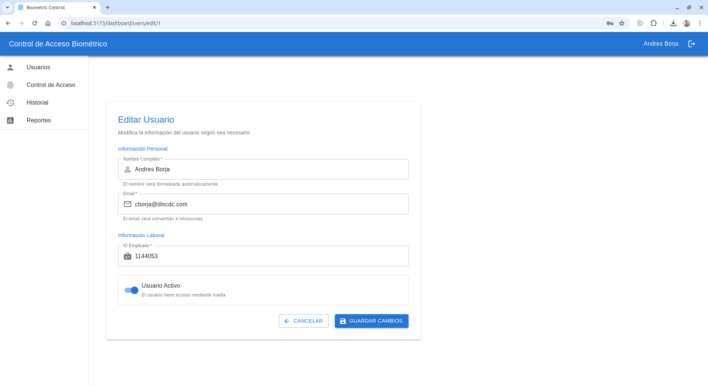
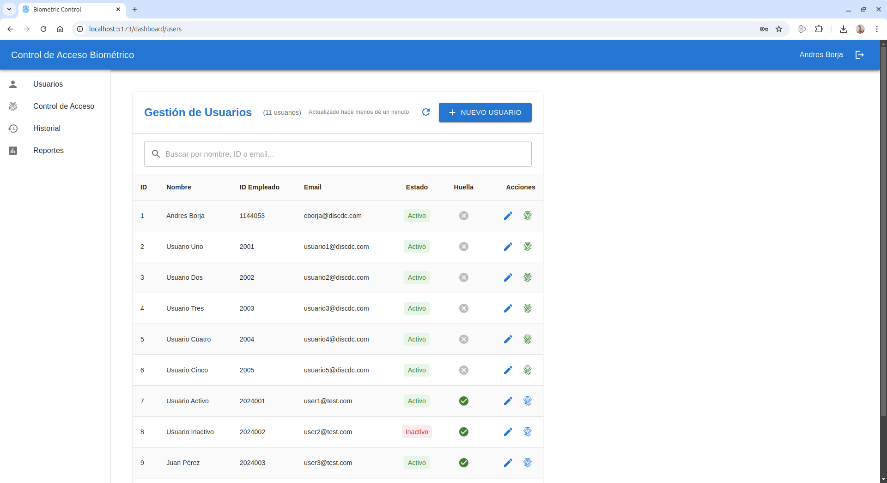
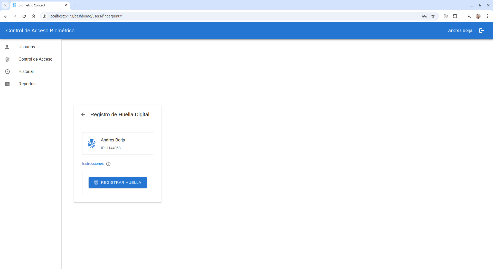
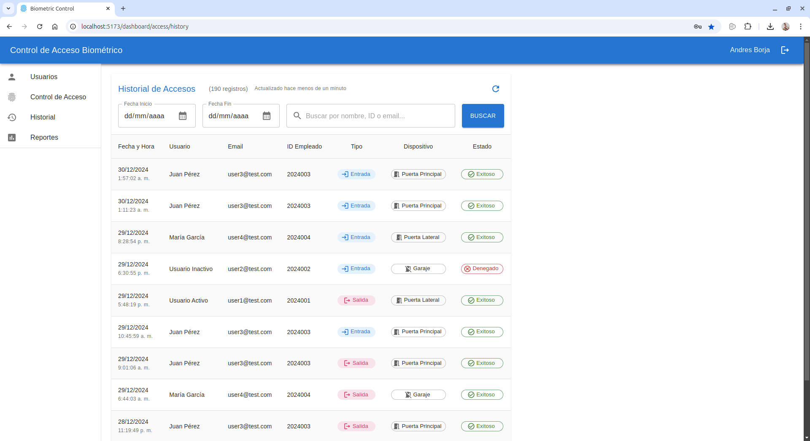
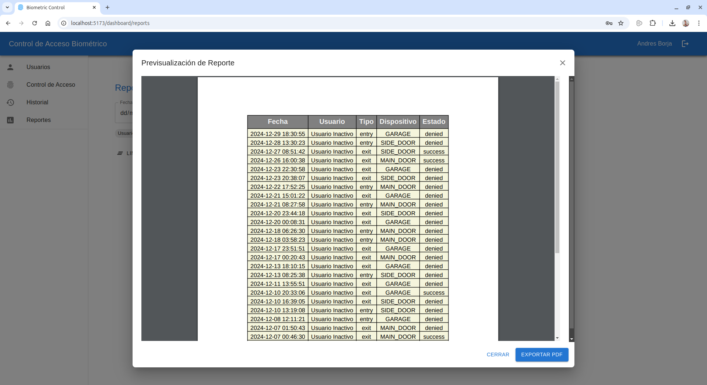

# 📖 Manual de Usuario - Sistema de Control de Acceso Biométrico

## 📋 Tabla de Contenidos
1. [Inicio de Sesión](#-inicio-de-sesión)
2. [Gestión de Usuarios](#-gestión-de-usuarios)
3. [Control de Acceso](#-control-de-acceso)
4. [Reportes](#-reportes)
5. [Navegación del Sistema](#-navegación-del-sistema)

## 🔑 Inicio de Sesión

### Acceso al Sistema
1. Abra su navegador web y diríjase a la URL de la aplicación
2. Ingrese sus credenciales:
   ```
   Email: cborja@discdc.com
   Contraseña: #Admin123
   ```

<p align="center">
  
</p>


3. Haga clic en "Iniciar Sesión"

### Consideraciones de Seguridad
- Mantenga su contraseña segura
- No comparta sus credenciales
- Cierre sesión al terminar
- Evite usar el sistema en computadoras públicas

## 👥 Gestión de Usuarios

### Vista de Usuarios
1. Acceda a la sección "Usuarios" desde el menú lateral

<p align="center">

</p>

2. Verá una lista con todos los usuarios registrados
3. La tabla muestra:
   - ID
   - Nombre
   - ID Empleado
   - Email
   - Estado
   - Huella
   - Acciones

### Crear Nuevo Usuario
1. Haga clic en el botón "NUEVO USUARIO"

<p align="center">

</p>

2. Complete los campos requeridos:
   - Nombre Completo (se formateará automáticamente)
   - Email (se convertirá a minúsculas)
   - ID Empleado
   - Contraseña (debe cumplir los requisitos):
     * Mínimo 6 caracteres
     * Al menos una letra mayúscula
     * Al menos una letra minúscula
     * Al menos un número
3. Active la casilla "Usuario Activo" si corresponde
4. Haga clic en "CREAR USUARIO"

### Editar Usuario
1. Localice el usuario en la lista

<p align="center">

</p>

2. Haga clic en el ícono de editar (lápiz)
3. Modifique la información necesaria

<p align="center">

</p>

4. Haga clic en "GUARDAR CAMBIOS"

### Registro de Huella Digital
1. Encuentre el usuario en la lista

2. Haga clic en el ícono de huella digital

<p align="center">

</p>


3. Siga las instrucciones en pantalla para el registro

<p align="center">

</p>

4. Haga clic en "REGISTRAR HUELLA"

## 🚪 Control de Acceso

### Historial de Accesos
1. Navegue a "Historial" en el menú lateral
2. Visualice la lista de todos los intentos de acceso

<p align="center">

</p>

3. Cada registro muestra:
   - Fecha y Hora
   - Usuario
   - Email
   - ID Empleado
   - Tipo (Entrada/Salida)
   - Dispositivo
   - Estado (Exitoso/Denegado)

### Filtrar Historial
1. Use los selectores de rango de fecha
2. Utilice la barra de búsqueda para filtrar por:
   - Nombre de usuario
   - ID
   - Email
3. Haga clic en "BUSCAR" para aplicar los filtros

## 📊 Reportes

### Generar Reportes de Acceso
1. Vaya a "Reportes" en el menú lateral
2. Seleccione:
   - Rango de fechas
   - Usuario específico (opcional)

<p align="center">

</p>

3. Opciones disponibles:

<p align="center">

</p>

   - "PREVISUALIZAR PDF" - Ver el reporte
   - "EXPORTAR PDF" - Descargar el reporte

### Opciones de Reportes
- "LIMPIAR FILTROS" - Resetea todos los filtros
- Selección de rango de fechas
- Filtrado por usuario específico
- Previsualización y exportación a PDF

## 🧭 Navegación del Sistema

### Menú Principal
- 👥 Usuarios
  - Gestión de usuarios
  - Registro de huellas
- 🚪 Control de Acceso
  - Configuración de accesos
- 📜 Historial
  - Registro de eventos
- 📊 Reportes
  - Generación de informes

### Cerrar Sesión
- Haga clic en el ícono de salida en la esquina superior derecha

## ⚙️ Mejores Prácticas
1. Revise regularmente los registros de acceso
2. Mantenga actualizada la información de usuarios
3. Genere reportes periódicos para auditoría
4. Cierre sesión al terminar
5. Mantenga la seguridad de las contraseñas

## ❓ Solución de Problemas

### Problemas Comunes y Soluciones
1. No puede iniciar sesión:
   - Verifique sus credenciales
   - Asegúrese de que su cuenta esté activa
   - Compruebe su conexión a internet

2. Error al registrar huella:
   - Limpie el sensor de huella
   - Asegúrese de posicionar correctamente el dedo
   - Intente nuevamente siguiendo las instrucciones

3. Problemas de visualización:
   - Actualice la página
   - Limpie el caché del navegador
   - Use un navegador compatible

### Contacto de Soporte
Si encuentra problemas persistentes:
1. Documente el problema
2. Capture pantallas si es posible
3. Contacte al administrador del sistema
4. Envíe un correo a soporte técnico

## 🔔 Recordatorios Importantes
- Actualice regularmente las contraseñas
- Mantenga el registro de huellas actualizado
- Reporte cualquier actividad sospechosa
- Realice copias de seguridad de los reportes importantes

---
Para soporte adicional, contacte al equipo técnico en [cborja@discdc.com](mailto:cborja@discdc.com)