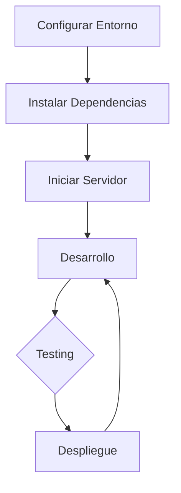
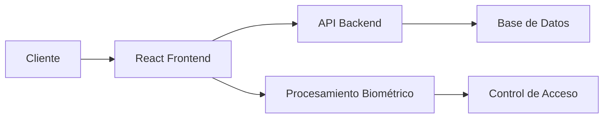

# 🔐 Sistema de Control de Acceso Biométrico

[](https://reactjs.org/)
[](https://mui.com/)
[](https://developer.mozilla.org/es/docs/Web/JavaScript)

Un sistema moderno de control de acceso biométrico construido con React, Material UI y JavaScript.

## 📋 Tabla de Contenidos
- [Requisitos](#requisitos)
- [Instalación](#instalación)
- [Características](#características)
- [Estructura del Proyecto](#estructura-del-proyecto)
- [Manual de Usuario](#manual-de-usuario)

## 🔧 Requisitos
- Node.js (v14 o superior)
- npm (v6 o superior)
- Navegador web moderno
- Conexión a Internet

## 💻 Instalación

1. Clonar el repositorio:
```bash
git clone https://github.com/anvorja/biometric_control_access_frontend.git
cd biometric_control_access_frontend
```

2. Instalar dependencias:
```bash
npm install
```

3. Iniciar el servidor de desarrollo:
```bash
npm run dev
```

4. Abrir el navegador en:
```
http://localhost:5173
```

## ⭐ Características

### 👥 Gestión de Usuarios
- Crear, editar y gestionar usuarios
- Registro de huellas dactilares
- Búsqueda y filtrado de usuarios
- Estado activo/inactivo de usuarios

### 🚪 Control de Acceso
- Seguimiento de entradas y salidas
- Monitoreo de intentos de acceso
- Registro histórico de accesos
- Control por huella dactilar

### 📊 Reportes
- Generación de informes de acceso
- Filtrado por fecha y usuario
- Exportación a PDF
- Visualización previa de reportes

### 🔐 Seguridad
- Sistema de login con email/contraseña
- Control de acceso basado en roles
- Gestión de sesiones
- Validación de datos

## 📁 Estructura del Proyecto

```
.
├── eslint.config.js
├── index.html
├── package.json
├── package-lock.json
├── public
│   └── vite.svg
├── README.md
├── src
│   ├── App.css
│   ├── App.jsx
│   ├── assets
│   │   └── react.svg
│   ├── components
│   │   ├── access
│   │   │   └── AccessFilter.jsx
│   │   ├── common
│   │   │   ├── Loading.jsx
│   │   │   └── Snackbar.jsx
│   │   ├── layout
│   │   │   ├── Header.jsx
│   │   │   └── Sidebar.jsx
│   │   └── PrivateRoute.jsx
│   ├── config
│   │   └── theme.js
│   ├── context
│   │   ├── AuthContext.js
│   │   ├── AuthProvider.jsx
│   │   ├── index.js
│   │   └── SnackbarContext.jsx
│   ├── index.css
│   ├── layouts
│   │   └── DashboardLayout.jsx
│   ├── main.jsx
│   ├── pages
│   │   ├── access
│   │   │   ├── AccessControl.jsx
│   │   │   └── AccessHistory.jsx
│   │   ├── auth
│   │   │   └── Login.jsx
│   │   ├── reports
│   │   │   └── Reports.jsx
│   │   └── users
│   │       ├── UserEdit.jsx
│   │       ├── UserFingerprint.jsx
│   │       ├── UserForm.jsx
│   │       └── UserList.jsx
│   ├── services
│   │   ├── accessService.js
│   │   ├── authService.js
│   │   ├── biometricService.js
│   │   └── userService.js
│   └── utils
│       ├── hooks
│       │   ├── useAuth.js
│       │   └── useSnackbarHooks.js
│       ├── index.js
│       ├── strings.js
│       └── validations.js
└── vite.config.js

```

## 🔄 Flujo de Desarrollo



## 🏗️ Arquitectura del Sistema



## 📝 Credenciales de Prueba

Para acceder al sistema de prueba:
- Email: cborja@discdc.com
- Contraseña: #Admin123

## 🌐 Enlaces Útiles
- [Manual de Usuario](./MANUAL.md)


## 🤝 Soporte

Para más información o soporte, contacte al equipo de desarrollo en [cborja@discdc.com](mailto:cborja@discdc.com)

---
